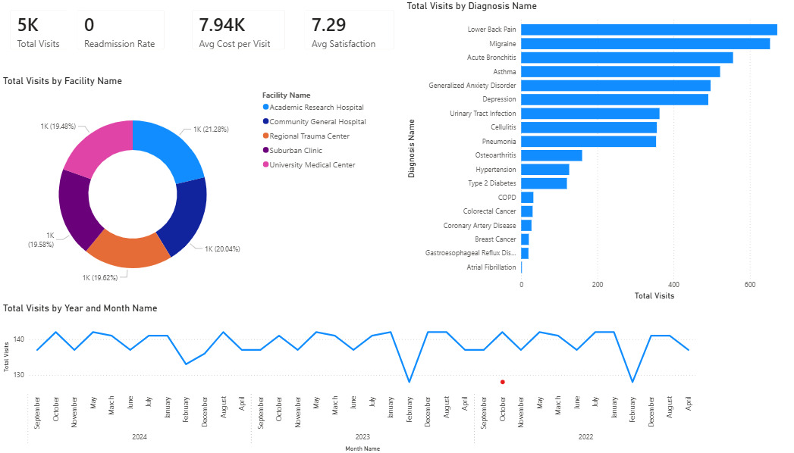
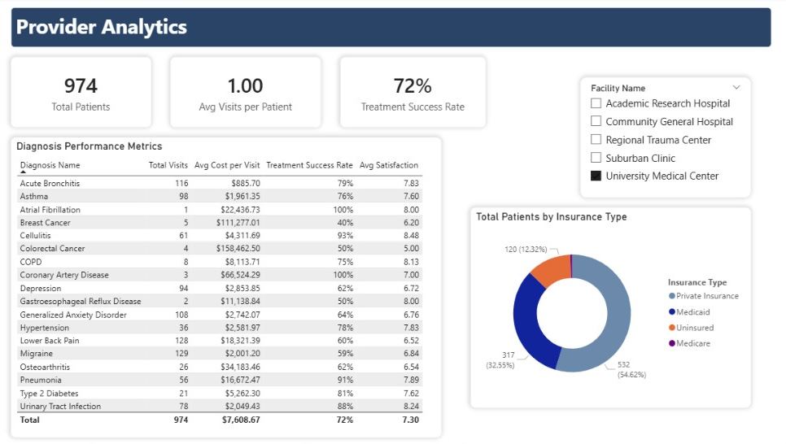
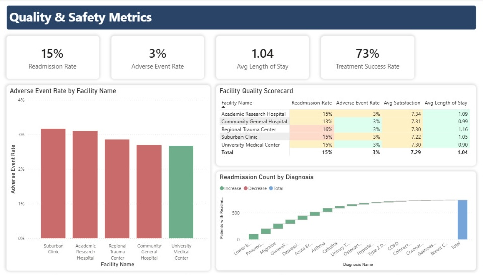
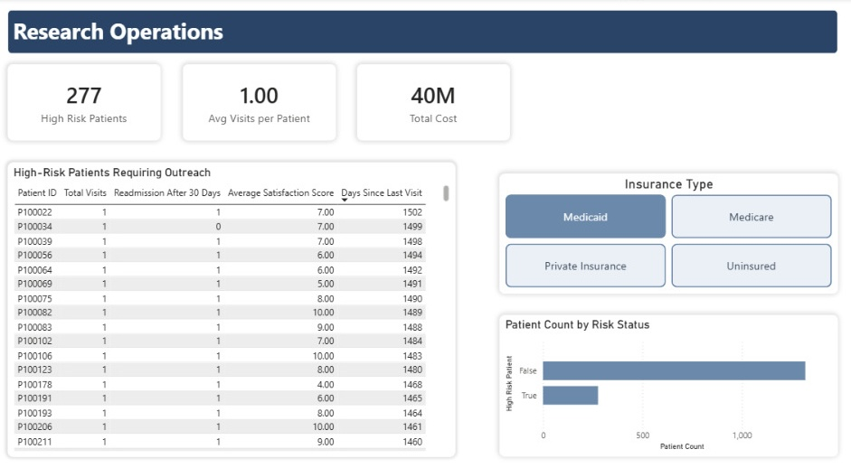

# Healthcare BI Solution

Power BI analytics for healthcare clinical outcomes analysis.

## Architecture
Data flows from synthetic generation → Azure SQL warehouse → 
data mart → Power BI dashboards

## Key Features
- 4 interactive dashboards
- 15 DAX measures
- Row-Level Security
- HIPAA/FIPPA governance principles

## Dashboards
1. Clinical Performance Overview

2. Provider Analytics

3. Quality & Safety

4. Research Operations

## Technologies
- Power BI (DirectQuery, DAX)
- Azure SQL Database
- Python (pandas, SQLAlchemy)
- Dimensional modeling (Kimball)

## Data

This project uses synthetic clinical data generated to simulate realistic healthcare visits. Maintains full HIPAA compliance. 

**Features:**
- 5,000 patient encounters across 20 diagnoses
- Realistic cost distributions and treatment patterns
- Social determinants of health variables
- Health equity metrics
- HIPAA-compliant de-identification

**Data generation script:** `/data/generate_clinical_data.py`

## Setup Instructions
1. Create Azure SQL Database
2. Run warehouse_schema.sql
3. Run datamart_schema.sql
4. Execute warehouse_etl.py
5. Execute datamart_etl.py
6. Open HealthcareAnalytics.pbix in Power BI Desktop
7. Update connection credentials

--

*Project in progress*