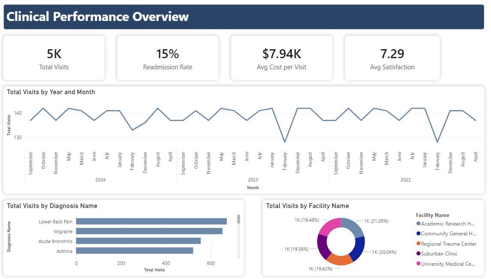
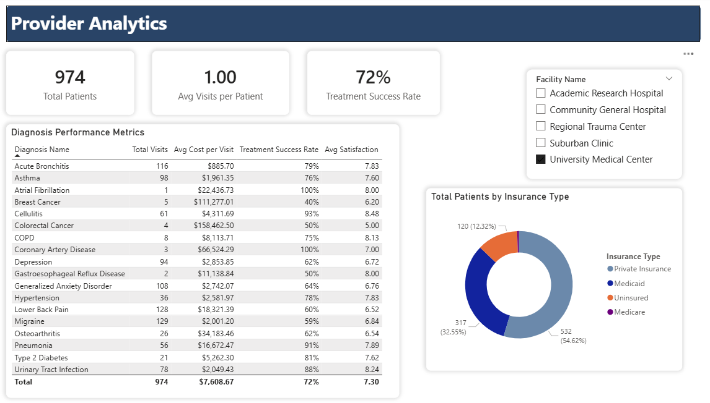
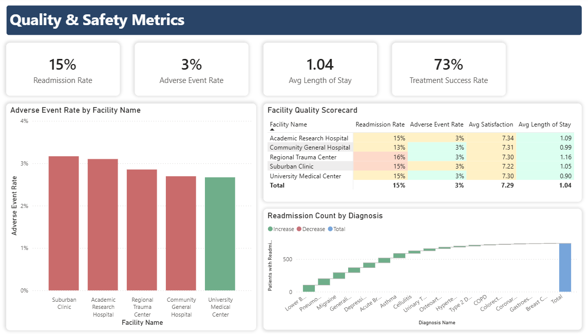
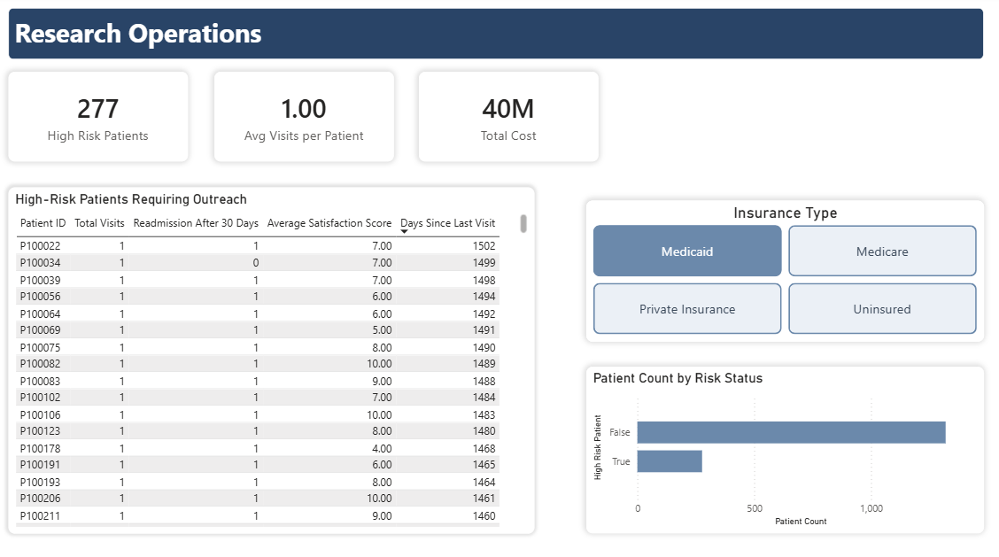
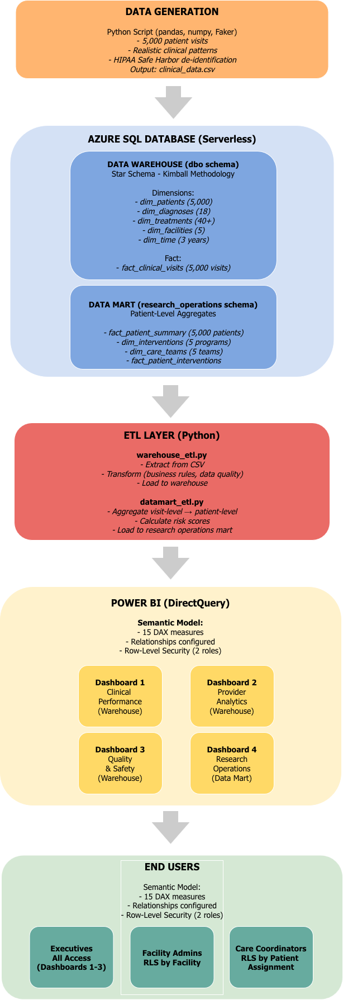

# Healthcare BI Solution

Power BI analytics of clinical outcomes using Azure SQL Database, Python ETL pipelines, and dimensional modeling.<br>
VIDEO: https://youtu.be/1rt85BteuPA 

## Screenshots

### Clinical Performance Overview


### Provider Analytics


### Quality & Safety Metrics


### Research Operations


## Architecture

Data flows from synthetic data generation → Azure SQL warehouse → data mart → Power BI dashboards<br>



## Key Features
- 4 interactive Power BI dashboards with DirectQuery
- 15 DAX measures
- Star schema data warehouse with dimensional modeling (Kimball)
- Research operations data mart for patient-level analytics
- Row-Level Security by facility and department
- HIPAA/FIPPA data governance principles

## Technologies
- **BI Platform:** Power BI Desktop (DirectQuery, DAX)
- **Database:** Azure SQL Database (serverless)
- **ETL:** Python (pandas, SQLAlchemy, pyodbc)
- **Methodology:** Kimball dimensional modeling
- **Data Governance:** HIPAA Safe Harbor de-identification, Row-Level Security


## Dashboards

**1. Clinical Performance Overview**
- KPIs: Total visits, avg cost, readmission rate, satisfaction
- Visit trends over time
- Top diagnoses by volume
- Facility distribution

**2. Provider Analytics**
- Treatment performance by diagnosis
- Patient insurance mix
- Success rates and satisfaction scores
- Interactive facility filtering

**3. Quality & Safety Metrics**
- Readmission and adverse event rates
- Length of stay tracking
- Facility quality scorecard with conditional formatting
- Readmission drivers by diagnosis

**4. Research Operations**
- Based on data mart
- High-risk patient identification (865 patients)
- Patient outreach prioritization by days since last visit
- Risk status distribution
- Operational case management tool

## Data Model

**Warehouse (Star Schema):**
- `fact_clinical_visits` (5,000 visits)
- `dim_patients` (5,000 patients)
- `dim_diagnoses` (18 diagnoses)
- `dim_treatments` (40+ treatments)
- `dim_facilities` (5 facilities)
- `dim_time` (3 years)

**Data Mart (Research Operations):**
- `fact_patient_summary` (patient-level aggregates)
- `dim_interventions` (5 programs)
- `dim_care_teams` (5 teams)


## Data

This project uses synthetic clinical data generated to simulate realistic healthcare visits. Maintains full HIPAA/FIPPA compliance. 

**Features:**
- 5,000 patient encounters across 20 diagnoses
- Realistic cost distributions and treatment patterns
- Social determinants of health variables
- Health equity metrics
- HIPAA-compliant de-identification

**Data generation script:** `/data/generate_clinical_data.py`


## Setup Instructions
1. Create Azure SQL Database
2. Run warehouse_schema.sql
3. Run datamart_schema.sql
4. Execute warehouse_etl.py
5. Execute datamart_etl.py
6. Create HealthcareAnalytics.pbix in Power BI Desktop
7. Update connection credentials


Create Azure SQL Database
Run warehouse_schema.sql
Execute warehouse_etl.py
Run datamart_schema.sql
Execute datamart_etl.py
Create HealthcareAnalytics.pbix in Power BI Desktop
Update connection credentials
Created DAX measures and dashboard


## Setup Instructions

### Prerequisites
- Azure account
- Python 3.8+
- Power BI Desktop

### Steps

1. **Generate Synthetic Data**
```bash
python data/generate_clinical_data.py
```

2. **Create Azure SQL Database**
```bash
# Create serverless database in Azure Portal
# Note server name and credentials
```

3. **Run Database Schema**
```sql
# In Azure Query Editor, run:
database/warehouse_schema.sql
database/datamart_schema.sql
```

4. **Run ETL Pipelines**
```bash
# Update credentials in scripts first
python etl/warehouse_etl.py
python etl/datamart_etl.py
```

5. **Open Power BI Dashboard**
```
# Open powerbi/HealthcareAnalytics.pbix
# Update data source connection to your Azure SQL
# Enter your credentials
```

## Data Governance

**HIPAA Compliance:**
- Synthetic data following Safe Harbor de-identification method
- All 18 HIPAA identifiers removed
- Small cell suppression (n<5) in reporting

**Row-Level Security:**
- Facility Admin role: Access limited to assigned facility
- Executive role: Full access across all facilities
- Implemented via DAX filters on dimensions

**FIPPA Considerations:**
- Patient privacy protection aligned with Ontario regulations
- Audit logging enabled (production recommendation)
- Data minimization in operational dashboards

See `/docs/healthcare_data_governance.md` for details.

## DAX Measures

**Clinical KPIs:**
- Total Patients
- Total Visits
- Readmission Rate (30-day)
- Adverse Event Rate
- Treatment Success Rate
- Average Cost per Visit
- Average Length of Stay
- Average Patient Satisfaction

**Operational Metrics:**
- High Risk Patients (from data mart)
- Patients with Readmissions
- Average Visits per Patient

See `/docs/dax_measures.md` for formulas.

## Project Structure
```
healthcare-bi-solution/
├── README.md
├── .gitignore
├── data/
│   └── generate_clinical_data.py
├── database/
│   ├── warehouse_schema.sql
│   └── datamart_schema.sql
├── etl/
│   ├── warehouse_etl.py
│   └── datamart_etl.py
├── powerbi/
│   └── HealthcareAnalytics.pbix
├── images/
│   ├── dashboard1_clinical_overview.png
│   ├── dashboard2_provider_analytics.png
│   ├── dashboard3_quality_safety.png
│   └── dashboard4_research_operations.png
└── docs/
    ├── architecture_diagram.png
    ├── data_dictionary.md
    ├── healthcare_data_governance.md
    └── dax_measures.md
```

## Future Enhancements

- Azure Data Factory pipelines for production ETL
- Azure DevOps CI/CD automation
- Power BI REST API deployment scripts
- Predictive analytics (ML models for readmission risk)
- Real-time dashboards via Azure Event Hubs
- Microsoft Fabric integration


## License

This project is for portfolio demonstration purposes.